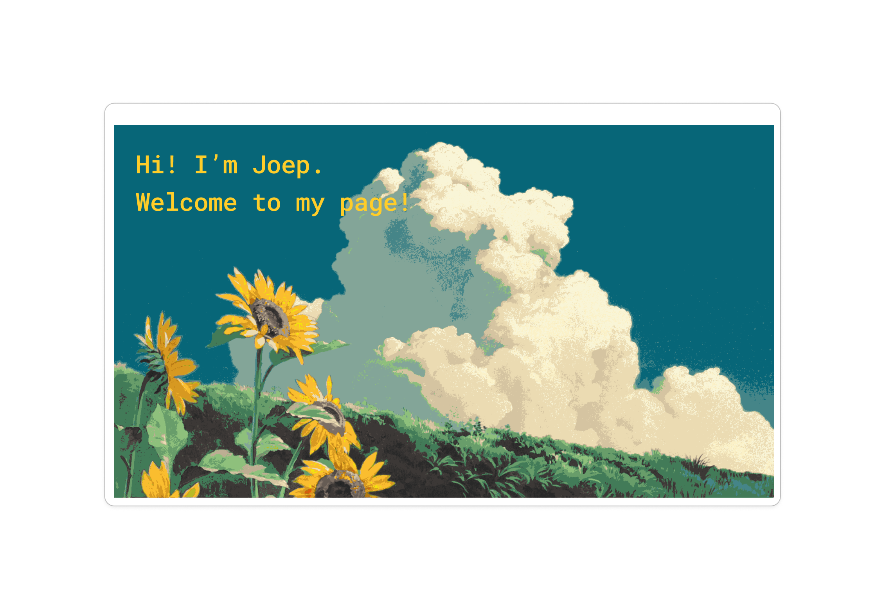

Hi!

I am Joep, a computer science graduate, generative art afficionado, with a passion for both front-end and back-end development. I thrive in a dynamic environment where I am challenged to improve myself. It is my mission to craft responsive and blazingly fast websites and applications. Let's connect and I will show you what I can do!

### 📌 Pinned Repositories

### &#x1f4c8; Github Stats

### 💼 Skills

#### Do not hesitate to get in touch!
